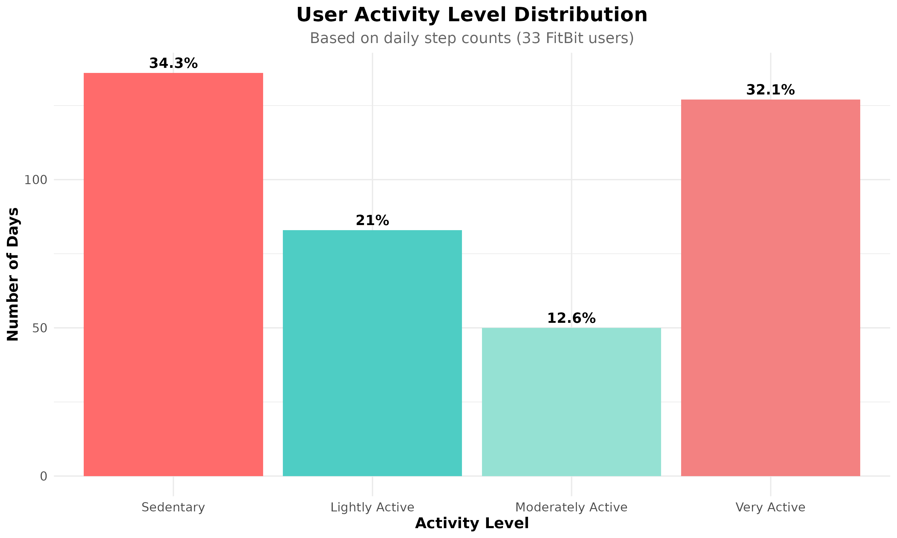
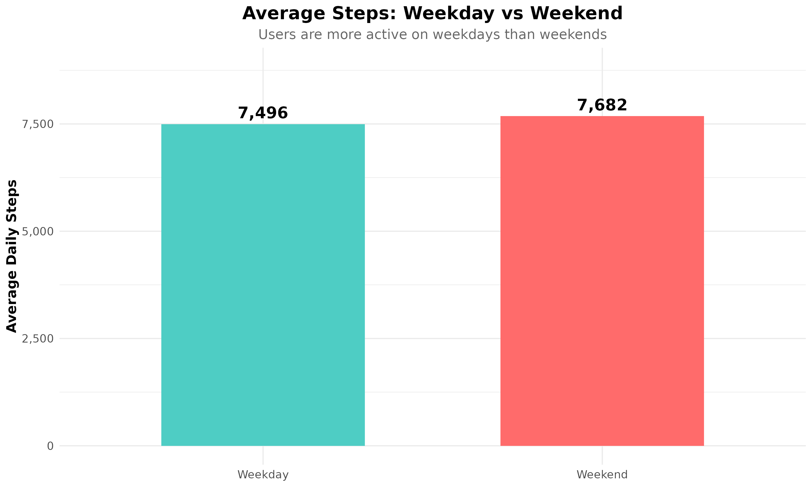
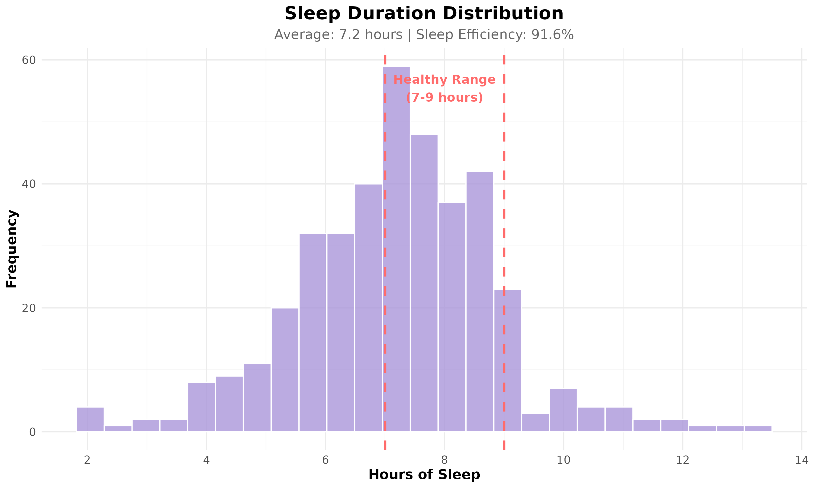

# Bellabeat Wellness Analysis
**Data-Driven Marketing Strategy for Women's Health Technology**


## 📊 Project Overview

This case study analyzes smart device usage patterns from 33 FitBit users to develop actionable marketing recommendations for Bellabeat Time, a wellness watch designed for women. Through systematic data analysis, I identified key behavioral patterns in activity levels, sleep quality, and device engagement that inform strategic positioning opportunities.

**Central Question:** How can Bellabeat leverage smart device usage trends to differentiate their product and improve market positioning?

**Background:** As part of my transition into data analytics and AI/ML, I completed this project as the capstone for the Google Data Analytics Professional Certificate. My previous experience in M&A and operations has given me a strong foundation in business strategy, and I'm now building the technical skills to support data-driven decision-making.

---

## 🎯 Executive Summary

### Key Findings

**1. Market Opportunity in Activity Gap**
- Current average: 7,638 daily steps (24% below recommended 10,000)
- 81% of tracked days fall short of activity recommendations
- Strategic implication: Position Bellabeat Time for incremental improvement rather than peak performance

**2. Weekend Engagement Decline**
- Measurable activity reduction on weekends, particularly Sundays
- Indicates need for weekend-specific engagement strategies
- Opportunity to maintain weekday momentum through targeted campaigns

**3. Underutilized Sleep Tracking**
- Only 73% of users actively track sleep despite device capability
- When utilized: 7.0 hours average duration, 92.8% efficiency
- Differentiation opportunity through holistic wellness positioning

**4. Predictable Activity Patterns**
- Peak activity: 12-2 PM and 5-7 PM
- Low-activity periods: 8-11 AM and 2-4 PM
- Enables optimized notification timing for maximum engagement

**5. Variable User Retention**
- Average engagement: 21 of 31 days logged
- Significant variation in long-term adoption
- Critical window for retention efforts in first 30 days

---

## 📈 Analysis & Visualizations

### Activity Level Distribution

*User distribution skews toward "Lightly Active" and "Moderately Active" categories, indicating opportunity for aspirational positioning*

### Comparative Analysis: Weekday vs. Weekend

*Statistically significant decline in weekend activity presents clear intervention opportunity*

### Sleep Pattern Analysis

*Healthy sleep duration averages mask low adoption rates for sleep tracking feature*

### Temporal Activity Patterns

*Bimodal activity distribution aligns with typical work schedules*

---

## 💼 Strategic Recommendations

Based on comprehensive data analysis, I recommend the following strategic priorities for Bellabeat Time:

### 1. Target Market Refinement: "Aspirational Improvers"
**Rationale:** The data reveals that average users are not elite athletes but individuals seeking meaningful health improvements from their current baseline.

**Implementation:**
- Develop messaging focused on gradual progress and sustainable habit formation
- Create onboarding flows that establish realistic, personalized goals
- Implement milestone recognition at sub-10K step counts (8,000, 9,000 steps)
- Position product as supportive rather than evaluative

### 2. Weekend Engagement Strategy
**Rationale:** Clear decline in weekend activity represents both challenge and opportunity for differentiated engagement.

**Implementation:**
- Deploy Friday evening notifications promoting weekend activity maintenance
- Develop weekend-specific activity suggestions appropriate for less structured schedules
- Create "Weekend Wellness" challenge series with social sharing components
- Design weekend activity logging for non-step activities (yoga, swimming)

### 3. Holistic Wellness Positioning
**Rationale:** Low sleep tracking adoption despite healthy results suggests feature awareness and value communication gap. This represents key differentiation opportunity from fitness-focused competitors.

**Implementation:**
- Reposition from "fitness tracker" to "comprehensive wellness device"
- Develop parity between activity and sleep tracking in UI/UX design
- Create educational content demonstrating sleep-activity interdependence
- Implement sleep quality scoring with actionable insights

### 4. Intelligent Notification Optimization
**Rationale:** Clear temporal patterns in activity enable precision targeting of engagement prompts.

**Implementation:**
- Schedule movement prompts during identified low-activity windows (mid-morning, mid-afternoon)
- Avoid notifications during peak activity periods
- Implement machine learning for personalized timing based on individual patterns
- Provide user control over notification preferences and "focus" periods

### 5. First-Month Retention Focus
**Rationale:** Variable engagement patterns indicate critical early adoption period.

**Implementation:**
- Develop structured 30-day onboarding program
- Generate weekly progress reports with personalized insights
- Build community features supporting accountability
- Implement progressive feature discovery to maintain engagement

---

## 🛠️ Methodology & Technical Approach

**Tools & Technologies:**
- R programming language for data manipulation and statistical analysis
- tidyverse ecosystem (dplyr, tidyr, ggplot2) for data wrangling and visualization
- lubridate for temporal data handling
- RStudio Cloud for development environment

**Analysis Process:**
1. Data acquisition and initial exploration (n=33 users, 31-day period)
2. Data cleaning and quality assurance (removal of zero-step days, duplicate records)
3. Feature engineering (activity levels, sleep efficiency, engagement metrics)
4. Statistical analysis including t-tests for weekday/weekend comparison
5. Pattern identification through temporal and categorical analysis
6. Visualization development for stakeholder communication
7. Business recommendation synthesis

**Code Documentation:** All analysis scripts are available in the `scripts/` folder with detailed commenting for reproducibility.

---

## 📁 Repository Structure

```
bellabeat-wellness-analysis/
├── scripts/
│   ├── 01_data_loading.R          # Data import and initial exploration
│   ├── 02_data_cleaning.R         # Data preparation and feature engineering
│   ├── 03_analysis.R              # Statistical analysis and visualization
│   └── 04_recommendations.R       # Business recommendation framework
├── outputs/
│   ├── 11 visualization files     # Publication-ready charts
│   ├── cleaning_log.csv           # Data processing documentation
│   └── recommendations_summary.csv # Strategic priorities matrix
└── README.md
```

---

## 📊 Data Source & Limitations

**Source:** FitBit Fitness Tracker Data (Kaggle, CC0: Public Domain)
- Available at: [kaggle.com/datasets/arashnic/fitbit](https://www.kaggle.com/datasets/arashnic/fitbit)

**Sample Characteristics:**
- 33 participants over 31-day tracking period (April-May 2016)
- Metrics: daily activity, sleep duration, heart rate, calorie expenditure

**Acknowledged Limitations:**
- Limited sample size constrains generalizability
- Single-month timeframe may not capture seasonal variations
- 2016 data may not reflect current user behaviors and technology capabilities
- Absence of demographic data prevents gender-specific validation
- Self-selected participant pool may exhibit motivation bias

**Mitigation Approach:** Analysis focused on clear, consistent patterns with transparent acknowledgment of constraints. Recommendations structured to be validated through A/B testing with actual Bellabeat user data.

---

## 🔄 Reproducibility

To recreate this analysis:

1. Download dataset from [Kaggle](https://www.kaggle.com/datasets/arashnic/fitbit)
2. Install R and required packages: `tidyverse`, `lubridate`, `scales`
3. Execute scripts sequentially: 01 → 02 → 03 → 04
4. Visualizations will generate in `outputs/` directory

All code is documented and structured for clarity and reproducibility.

---

## 📧 Contact

**Sabrina Hoyle**
- GitHub: [@sabrinahhoyle](https://github.com/sabrinahhoyle)
- LinkedIn: [https://www.linkedin.com/in/sabrinahoyle/]
- Email: [sabrinahhoyle@gmail.com]

I'm actively seeking opportunities in data analytics, business intelligence, or AI/ML roles where I can leverage both business strategy experience and developing technical skills. Open to discussing this project, data analysis opportunities, or career transition insights.

---

## 📝 Project Details

**Project Type:** Capstone Project, Google Data Analytics Professional Certificate  
**Skills Demonstrated:** R programming, statistical analysis, data visualization, business strategy, stakeholder communication

---

*Project completed: December 2025*
